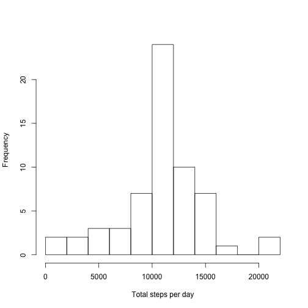

# Reproducible Research: Peer Assessment 1

Befor doing the project, I unzip the activity.zip file and set the Working Directory into the working folder.  

## Loading and preprocessing the data
Then I read the the dataset. In order to make a plot by dates, I make the type of date column be date type.

```r
activity <- read.csv("activity.csv")
activity$date <- as.Date(activity$date, format = "%Y-%m-%d")
```


## What is mean total number of steps taken per day?
First, I calculate the total number of steps taken per day and make a histogram.

```r
total <- with(activity, tapply(steps, date, sum))
hist(total, breaks = 10, xlab = "Total steps per day",
     main = "")
```


It looks like some days are 0, because these days data are missing. Then calculate the mean and median of the total number of steps. 

```r
mean(total, na.rm = TRUE)
```

```
## [1] 10766.19
```

```r
median(total, na.rm = TRUE)
```

```
## [1] 10765
```

So, Mean is 10766.19, and median is 10765.

## What is the average daily activity pattern?
I make a time series plot of the 5-minute interval (x-axis) and the average number of steps taken, averaged across all days (y-axis).

```r
interval_mean <- with(activity, tapply(steps, interval, mean, na.rm = TRUE))
plot(unique(activity$interval), interval_mean, type = "l", xlab = "5-minute interval",
     ylab = "The average number of steps")
```


Use which.max function to find out the maximum number of steps. 

```r
maxint <- which.max(interval_mean)
interval_mean[104]
```

```
##      835 
## 206.1698
```

So it's the interval 835, 206.1698 steps. 


## Imputing missing values
In order to impute missing data, I decide to use the mean for that 5-minute interval. So I first find out all the rows of missing data, then find out which interval them belong to, then create a new dataset that is equal to the original dataset but with the missing data filled in. 

```r
activity1 <- activity
index <- is.na(activity1$steps)
activity1[index, 1] <- interval_mean[as.character(activity1[index, 3])]
```

After these, I make the histogram of the total number of steps taken each day.

```r
total1 <- with(activity1, tapply(steps, date, sum))
hist(total1, breaks = 10, xlab = "Total steps per day",
     main = "")
```



```r
mean(total1, na.rm = TRUE)
```

```
## [1] 10766.19
```

```r
median(total1, na.rm = TRUE)
```

```
## [1] 10766.19
```

I also checked the mean and median total number of steps, comparing with the missing dataset, the mean is the same, but the median change. The median is equal to mean now.


## Are there differences in activity patterns between weekdays and weekends?
I use weekday function first to get the information of each date, then translate them into weekday or weekend. Then I create a new factor variable week in the dataset with two levels - "weekday" and "weekend" indicating whether a given date is a weekday or weekend day. After that, I create vector to store the mean of weekday and weekend, and use the lattice plot system to plot a time series plot.

```r
week <- weekdays(activity1$date)
week <- week == "Saturday" | week == "Sunday"
activity1$week <- factor(week, labels = c("weekday","weekend"))
interval_means <- c(with(activity1[activity1$week == "weekday",], 
                         tapply(steps, interval, mean, na.rm = TRUE)),
                    with(activity1[activity1$week == "weekend",], 
                         tapply(steps, interval, mean, na.rm = TRUE)))
n <- length(unique(activity1$interval))
fac <- rep(0:1, each = n)
fac <- factor(fac, labels = c("weekday","weekend"))
interval <- c(unique(activity1$interval), unique(activity1$interval))
library(lattice)
xyplot(interval_means ~ interval | fac, type = "l", layout = c(1,2),
       xlab = "5-minute interval", ylab = "The average number of steps")
```


So there are some differences between weekdays and weekends. And it seems that the weekdays data are more like whole dataset.
